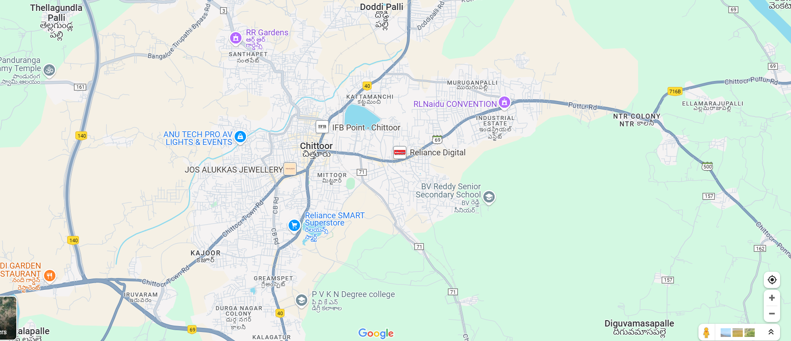
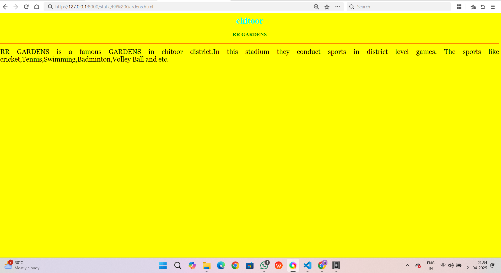
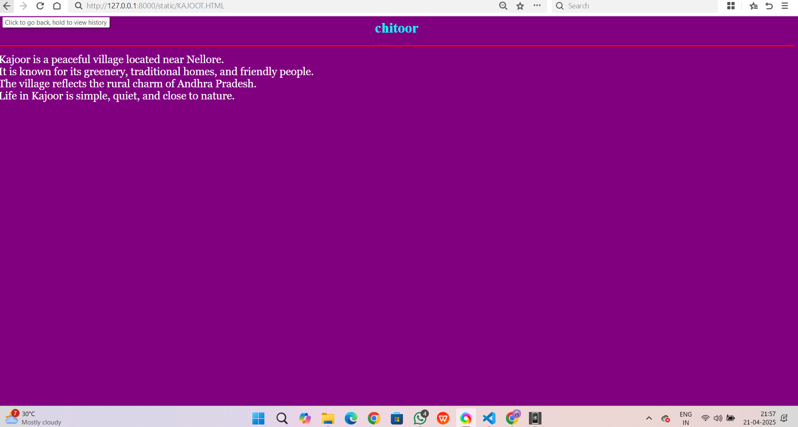
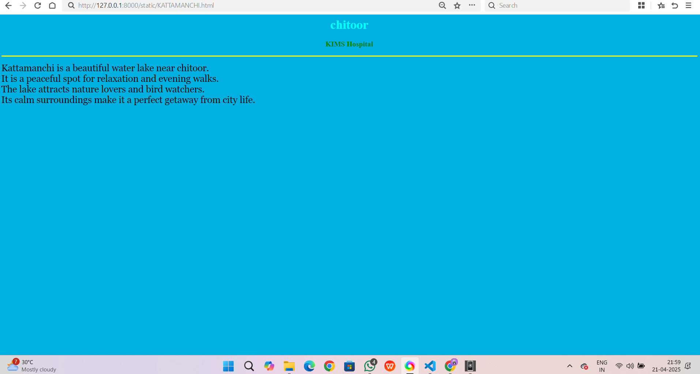
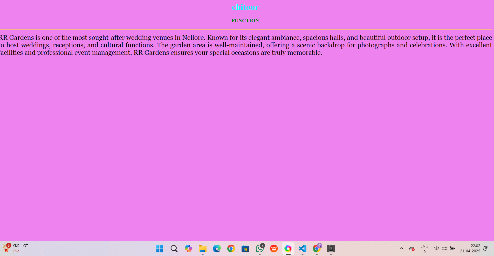
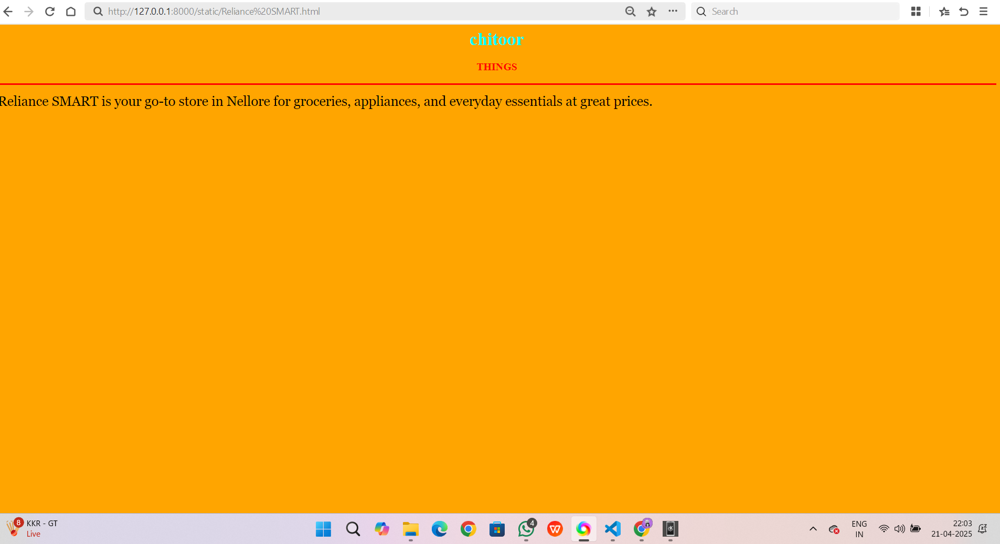

# Ex04 Places Around Me
## Date: 21-04-25

## AIM
To develop a website to display details about the places around my house.

## DESIGN STEPS

### STEP 1
Create a Django admin interface.

### STEP 2
Download your city map from Google.

### STEP 3
Using ```<map>``` tag name the map.

### STEP 4
Create clickable regions in the image using ```<area>``` tag.

### STEP 5
Write HTML programs for all the regions identified.

### STEP 6
Execute the programs and publish them.

## CODE
```
map.html

map.html

<html>
    <head>
        <title>My City</title>
    </head>
    <body>
        <h1 align="center">
            <font color="red"><b>Nellore</b></font>
        </h1>
        <h3 align="center">
            <font color="blue"><b>P G KUSHALI (212223230110)</b></font>
        </h3>
        <center>
            
            <map name="MyCity">
                <area target="" alt="GARDENS" title="marriage" href="RR Gardens.html" coords="698,365,913,496" shape="rect">
                <area target="" alt="area" title="village" href="KAJOOR.html" coords="250,360,220,100" shape="circle">
                <area target="" alt="LAKE" title="water LAKE" href="KATTAMANCHI.html" coords="700,250,600,300" shape="rect">
                <area target="" alt="FUNCTION" title="FUNCTION" href="RLNaidu CONVENTION.html" coords="580,300,50,50" shape="circle">
                <area target="" alt="APPLIANCES" title="needs" href="Reliance SMART.html" coords="60,60,150,150" shape="rect">
                <area target="" alt="" title="" href="" coords="" shape="0">
    
            </map>
        </center>  
    </body>
</html>

RR Gardens.html

<html>
    <head>
        <title>My City</title>
    </head>
    <body bgcolor="yellow">
        <h1 align="center">
            <font color="cyan"><b>chitoor</b></font>
        </h1>
        <h3 align="center">
            <font color="green"><b>RR GARDENS</b></font>
        </h3>
        <hr size="3" color="red">
        <p align="justify">
            <font face="Georgia" size="5" color="black">
                RR GARDENS is a famous GARDENS in chitoor district.In this stadium they conduct sports in district level games.
                The sports like cricket,Tennis,Swimming,Badminton,Volley Ball and etc.
            </font>
        </p>
    </body>
</html>

KAJOOR.html

<html>
    <head>
        <title>My City</title>
    </head>
    <body bgcolor="purple">
        <h1 align="center">
            <font color="cyan"><b>chitoor</b></font>
        </h1>
        <h3 align="center">
            <font color="lime"><b><AREA></AREA></b></font>
        </h3>
        <hr size="3" color="red">
        <p align="justify">
            <font face="Georgia" size="5" color="white">
                Kajoor is a peaceful village located near Nellore.<br>
                It is known for its greenery, traditional homes, and friendly people.<br>
                The village reflects the rural charm of Andhra Pradesh.<br>
                Life in Kajoor is simple, quiet, and close to nature.
            </font>
        </p>
    </body>
</html>

KATTAMANCHI.html

<html>
    <head>
        <title>My City</title>
    </head>
    <body bgcolor="sky blue">
        <h1 align="center">
            <font color="cyan"><b>chitoor</b></font>
        </h1>
        <h3 align="center">
            <font color="green"><b>KIMS Hospital</b></font>
        </h3>
        <hr size="3" color="yellow">
        <p align="justify">
            <font face="Georgia" size="5" color="black">
                Kattamanchi is a beautiful water lake near chitoor.<br>
    It is a peaceful spot for relaxation and evening walks.<br>
    The lake attracts nature lovers and bird watchers.<br>
    Its calm surroundings make it a perfect getaway from city life.
 
            </font>
        </p>
    </body>
</html>

RLNaidu CONVENTION.html


<html>
    <head>
        <title>My City</title>
    </head>
    <body bgcolor="violet">
        <h1 align="center">
            <font color="cyan"><b>chitoor</b></font>
        </h1>
        <h3 align="center">
            <font color="green"><b>FUNCTION</b></font>
        </h3>
        <hr size="3" color="yellow">
        <p align="justify">
            <font face="Georgia" size="5" color="black">
                RR Gardens is one of the most sought-after wedding venues in Nellore. Known for its elegant ambiance, spacious halls, and beautiful outdoor setup, it is the perfect place to host weddings, receptions, and cultural functions. The garden area is well-maintained, offering a scenic backdrop for photographs and celebrations. With excellent facilities and professional event management, RR Gardens ensures your special occasions are truly memorable.
            </font>
        </p>
    </body>
</html>

Reliance SMART
              
<html>
    <head>
        <title>My City</title>
    </head>
    <body bgcolor="orange">
        <h1 align="center">
            <font color="cyan"><b>chitoor</b></font>
        </h1>
        <h3 align="center">
            <font color="red"><b>THINGS</b></font>
        </h3>
        <hr size="3" color="red">
        <p align="justify">
            <font face="Georgia" size="5" color="black">
                Reliance SMART is your go-to store in Nellore for groceries, appliances, and everyday essentials at great prices.
            </font>
        </p>
    </body>
</html>


```


## OUTPUT












## RESULT
The program for implementing image maps using HTML is executed successfully.
